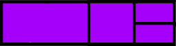

# tegelzetter
#### Hotkey-Based Window Tiling for GNOME with Wayland

## Installation

#### Clone this repository

```bash
git clone https://github.com/palmer-sec/tegelzetter && cd tegelzetter
```

#### Make

```bash
make install
make reload
```

## Usage

The goal of this project is to create an environment that can offer an efficient workflow by providing 
key bindings that will be useful on ultrawide monitors.
With only a few key bindings, windows can be tiled quickly into configurations like the example below:
                                                                                


### Key Bindings

Key bindings are assigned to physically reflect the position on the screen being targeted to make
it easier to remember. Starting from the top left of your keyboard, the first four keys are
Q, W, E, and R. These keys are mapped to the top 4 positions at 50% screen height and 25% screen width.
A, S, D, and F are mapped to the bottom four positions and H, J, K, and L are mapped to the 4 positions at
100% height and 25% width. See the table below.

| Binding | Result |
| :---    | :---   |
| `[ctrl]+[super]+q` |  |
| `[ctrl]+[super]+w` |  |
| `[ctrl]+[super]+e` |  |
| `[ctrl]+[super]+r` |  |
| `[ctrl]+[super]+a` |  |
| `[ctrl]+[super]+s` |  |
| `[ctrl]+[super]+d` |  |
| `[ctrl]+[super]+f` |  |
| `[ctrl]+[super]+h` |  |
| `[ctrl]+[super]+j` |  |
| `[ctrl]+[super]+k` |  |
| `[ctrl]+[super]+l` |  |
Fig 4: Key binding table

## Future Improvements & Additions

+ Add additional tiling geometry, including 50% vertically & horizontally
+ Add a 'settings' or 'config' gui to customize keyboard shortcuts
+ Solve the issue regarding window positioning after sleep or screen lock
+ Solve the issue regarding GNOME's default tiling interrupting tegelzetter and requiring a `[super]+down` press to escape GNOME's default tiling mode. 
+ introducing a 'screen move' mode that allows windows to be individually resized with hotkeys. 
